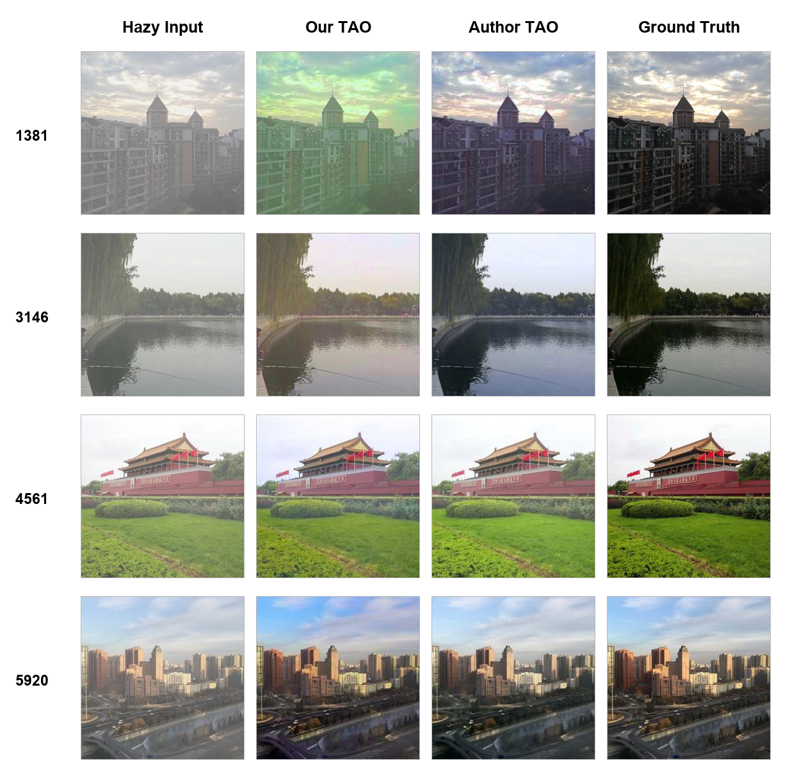

# Test-Time Degradation Adaptation for Open-Set Image Restoration

> **Attribution and scope.** TAO is the work of **Yuanbiao Gou, Haiyu Zhao, Boyun Li, Xinyan Xiao, and Xi Peng**, published as an ICML 2024 Spotlight paper. The method and original implementation are not the work of this reproduction study. See the [original TAO repository](https://github.com/YBGou/2024-ICML-TAO) and cite the original paper below. This working tree adds an independent dehazing reproduction and empirical audit on top of the upstream project.

## Reproduction Study

This repository extension reproduces the **HSTS image dehazing** task and documents both the successful execution of the public pipeline and the remaining gap to the author-provided outputs.

- **Environment:** Windows, Python 3.10, PyTorch 2.7.1+cu128, NVIDIA GeForce RTX 5060 Laptop GPU
- **Evaluation set:** 10 processed HSTS images at 256×256
- **Detailed record:** [TAO Dehazing Reproduction](REPRODUCTION.md)

| Evaluated images | PSNR (dB) | SSIM |
|---|---:|---:|
| Hazy Input | 14.7446 | 0.753592 |
| Author-provided TAO | 22.3276 | 0.856213 |
| Our Reproduction | 18.7119 | 0.797267 |

These values use the same custom **RGB PSNR/SSIM evaluator** for all three groups, making them suitable for an internally consistent comparison. They must not be presented as identical to the paper's official SSIM protocol; the official IQA implementation is not available in the current working tree.

The complete report covers the [pipeline, per-image metrics, reproduction gap, controlled Fresh B experiment, byte-level reproducibility audit, and limitations](REPRODUCTION.md).



## Reproduction Artifacts

- [`REPRODUCTION.md`](REPRODUCTION.md) — full experimental record and limitations
- [`evaluate_reproduction.py`](evaluate_reproduction.py) — unified RGB PSNR/SSIM evaluator
- [`reproduction_metrics.csv`](reproduction_metrics.csv) — per-image quantitative results
- [`reproduction_assets/`](reproduction_assets/) — comparison figure and reproducible figure-generation script
- [`results_batch_ours/`](results_batch_ours/) — 10-image reproduction outputs

## Important Reproducibility Note

At the audited state, the public `origin/main` records `gen_dif_pri` as a Git gitlink (`160000`, object `b34494cd53e344a5c726e502f552cd7fb888aad0`) but provides no `.gitmodules` entry. A fresh clone therefore cannot initialize this path through the normal Git submodule workflow.

For this reproduction, the complete `gen_dif_pri/` source tree was restored from the official repository history at commit [`9de6173479f1d76f81f003c70c6dbe6f7786ac8b`](https://github.com/YBGou/2024-ICML-TAO/commit/9de6173479f1d76f81f003c70c6dbe6f7786ac8b). This restored code belongs to the original TAO authors/upstream project; it is required infrastructure, not original code contributed by the reproduction study.

---

## Original TAO Project and Usage

The remainder of this page preserves the essential upstream description and usage information.

### About TAO

The original work studies Open-Set Image Restoration (OIR) as a distribution-shift problem and proposes a test-time degradation adaptation framework for addressing unseen degradations.

### Upstream Environment

The authors report testing the code with **PyTorch 2.0.1**, **CUDA 11.7**, and **Ubuntu 20.04**:

```bash
pip install -r requirements.txt
```

### Pretrained Model and Datasets

Download the pretrained unconditional ImageNet-256 DDPM, `256x256_diffusion_uncond.pt`, from [OpenAI guided-diffusion](https://github.com/openai/guided-diffusion) and place it in `test_models/`. Model checkpoints are intentionally excluded from this Git repository.

The upstream project uses:

- the synthetic HSTS dataset from [RESIDE](https://sites.google.com/view/reside-dehaze-datasets/reside-standard?authuser=3D0) for image dehazing;
- test pairs from [LOL](https://daooshee.github.io/BMVC2018website/) for low-light enhancement; and
- [Kodak24](https://github.com/MohamedBakrAli/Kodak-Lossless-True-Color-Image-Suite/tree/master) with Gaussian noise at $\sigma=30$ for denoising.

Because the DDPM operates at 256×256, the upstream README states that dataset images are center-cropped along the shorter edge and resized. Processed samples and author-provided results are under `test_samples/`.

### TTA for OIR Tasks

The upstream README explains that the loss weights $\lambda_{1-3}$, $\gamma_{1-5}$ and guidance scale $s$ are adjusted per degradation type using representative images, then applied to all images with that degradation. Parameters for the degradations reported in the paper are provided in the task scripts.

Single Image Dehazing:

```bash
python sample_dehazing.py --sample_dir input_image_folder --result_dir output_image_folder
```

Low-light Image Enhancement:

```bash
python sample_lowlightE.py --sample_dir input_image_folder --result_dir output_image_folder
```

Single Image Denoising (Gaussian noise, $\sigma=30$):

```bash
python sample_denoising.py --sample_dir input_image_folder --result_dir output_image_folder
```

The upstream Ubuntu script runs multiple input folders concurrently across GPUs. Its task blocks are commented by default and must be enabled before use:

```bash
bash tta_scripts.sh
```

The original README specifies the following IQA commands:

```bash
python img_qua_ass/inference_iqa.py -m PSNR -i result_image_folder -r ground_truths_folder
python img_qua_ass/inference_iqa.py -m SSIM -i result_image_folder -r ground_truths_folder
```

In the audited working tree, `img_qua_ass/` is empty; see [the reproduction limitations](REPRODUCTION.md#12-limitations) for the evaluation protocol used in this study.

## Citation

If you use TAO or its original code, cite the authors' paper:

```bibtex
@inproceedings{gou2024tao,
    title={Test-Time Degradation Adaptation for Open-Set Image Restoration},
    author={Yuanbiao Gou and Haiyu Zhao and Boyun Li and Xinyan Xiao and Xi Peng},
    booktitle={Forty-first International Conference on Machine Learning},
    month={Jul.},
    year={2024}
}
```

## Acknowledgement

The original TAO repository is built upon [guided-diffusion (GD)](https://github.com/openai/guided-diffusion), [GenerativeDiffusionPrior (GDP)](https://github.com/Fayeben/GenerativeDiffusionPrior), and [IQA-PyTorch](https://github.com/chaofengc/IQA-PyTorch). Credit for TAO and its upstream implementation remains with the original authors.
